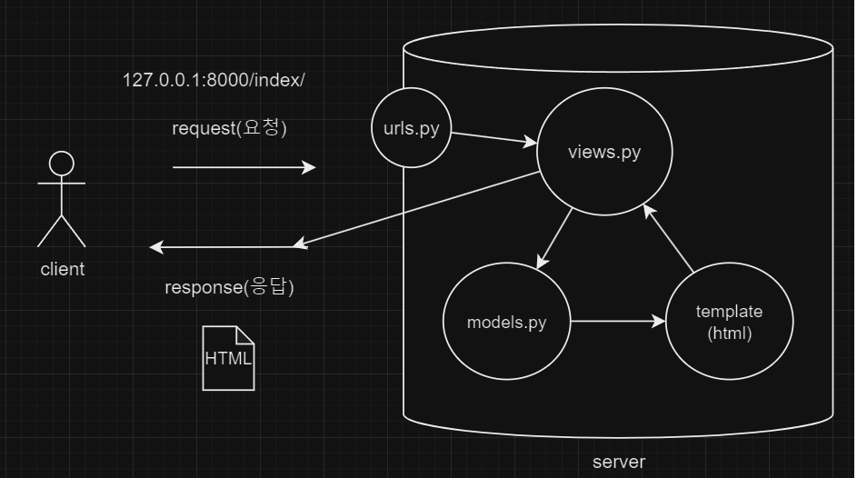

# django

1. 프로젝트 생성

```bash
django-admin startproject first_pjt .

```

2. 가상환경 설정

```bash
python -m venv venv
```

3. 가상환경 활성화

```bash
source venv/Scripts/activate
```

4. 가상환경 내부에 django 설치
```bash
pip install django
```

5. 서버 실행 확인 (종료: ctrl c)
```bash
python manage.py runserver
```

6. 앱 생성
```bash
django-admin startapp <appname>

```

7. 앱 등록
- settings.py의 `INSTALLED_APPS`에 등록
- `<appname>`을 등록

8. `urls.py`
```python
from first_app import views

urlpatterns = [
    ...
    path('index/', views.index)
]
```

9. `views.py`
```python
def index(request):
    return render(request, 'index.html')
```

10. templates 폴더 생성 => index.html 생성

## MTV
